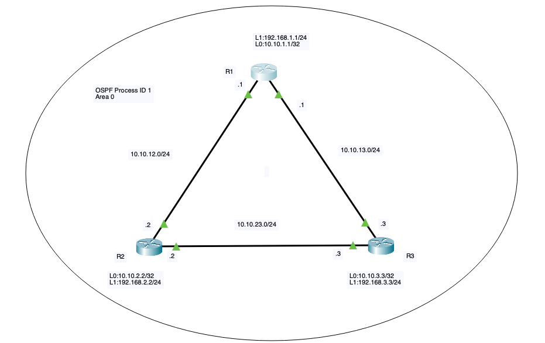

# OSPF #
>應用在中大型企業的內部網路和資料中心。

>1. 多棟大樓的校園網路或廠區：例如學校有行政大樓、教學大樓、宿舍，各樓層都有網段。使用 OSPF 可以讓幾十台路由器自動交換網段資訊。
>2. 擁有「多條備用線路」的雙活企業內網：企業為防斷線，總部與分公司間常拉「專線 A」和「備用 VPN B」，OSPF 非常擅長在這種多線路環境中做自動切換與負載平衡。
>3. 雲端與現代資料中心：在動輒數百、數千台伺服器交換機的核心骨幹網中，利用 OSPF 的分區特性進行高速轉發與大規模擴充。

## 優點 ##
>1. 收斂速度快: 當某條網路線被挖斷時，OSPF 能在幾秒鐘之內通知全網，並自動切換到備用線路。
>2. 以「網速（頻寬）」選路，而非看距離：OSPF 衡量路徑好壞的標準叫 Cost。頻寬越大（網速越快），Cost 就越低。
>3. 無路由迴圈（Loop-Free）：OSPF 採用 Dijkstra演算法，每台路由器手裡都有完整的全網地圖（LSDB），大腦看得很清楚，絕對不會發生封包在網路裡無限打轉的死迴圈。
>4. 支援區域劃分（Multi-Area）：可以把網路切成多個區域。當其中一個區域斷線時，只有這個內部重新計算，不會驚動其他區域，極大程度節省了路由器的 CPU 與記憶體資源。

## 配置方法 ##
### 範例1 ###

>三台路由器之間 IP 連線已設定。建立 OSPF 鄰接關係。
>1. 使用它們之間共享鏈路的介面IP地址配置R1和R2的路由器ID。
>2. 配置R2面向R1和R3的鏈路，將其最大值設置為，使R2成為DR。面向R2的R1和R3鏈路必須保持默認的OSPF配置以進行DR選舉。在清除OSPF過程後驗證配置。
>3. 使用主機通配符掩碼，配置所有三個路由器廣播各自的Loopback1網路。
>4. 配置R1和R3之間的鏈路，以禁用其添加其他OSPF路由器的能力。

    R1
    router ospf 1 
      router-id 10.10.12.1
      network 10.10.12.0 0.0.0.255 area 0
      network 10.10.13.0 0.0.0.255 area 0
      network 192.168.1.1 0.0.0.0 area 0
      exit
    int e0/1
      ip ospf priority 0
      end
    clear ip ospf process

    R2
    router ospf 1
      router-id 10.10.12.2
      network 10.10.12.0 0.0.0.255 area 0
      network 10.10.23.0 0.0.0.255 area 0
      network 192.168.2.2 0.0.0.0 area 0
      exit
    int e0/0
      ip ospf priority 255
    int e0/2
      ip ospf priority 255
      end
    clear ip ospf process

    R3
    router ospf 1
      network 10.10.13.0 0.0.0.255 area 0
      network 10.10.23.0 0.0.0.255 area 0
      network 192.168.3.3 0.0.0.0 area 0
      exit
    int e0/1
      ip ospf priority 0
      end
    clear ip ospf process
      
